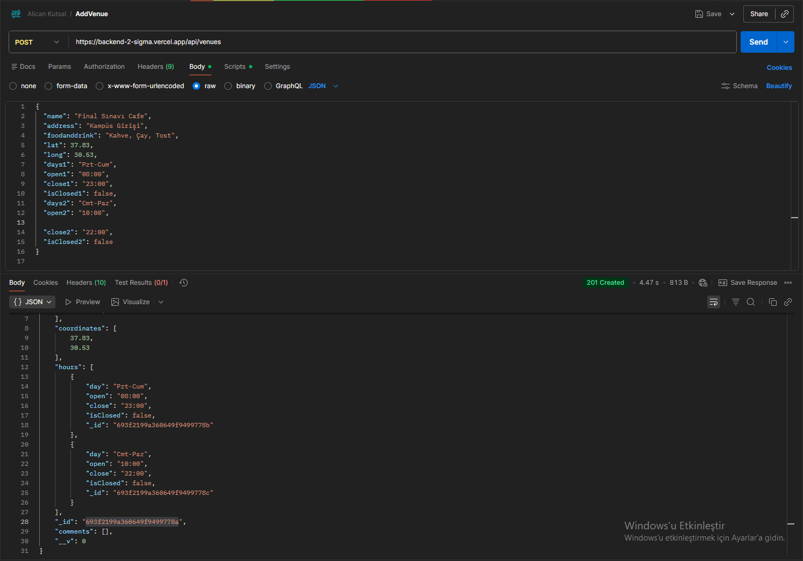
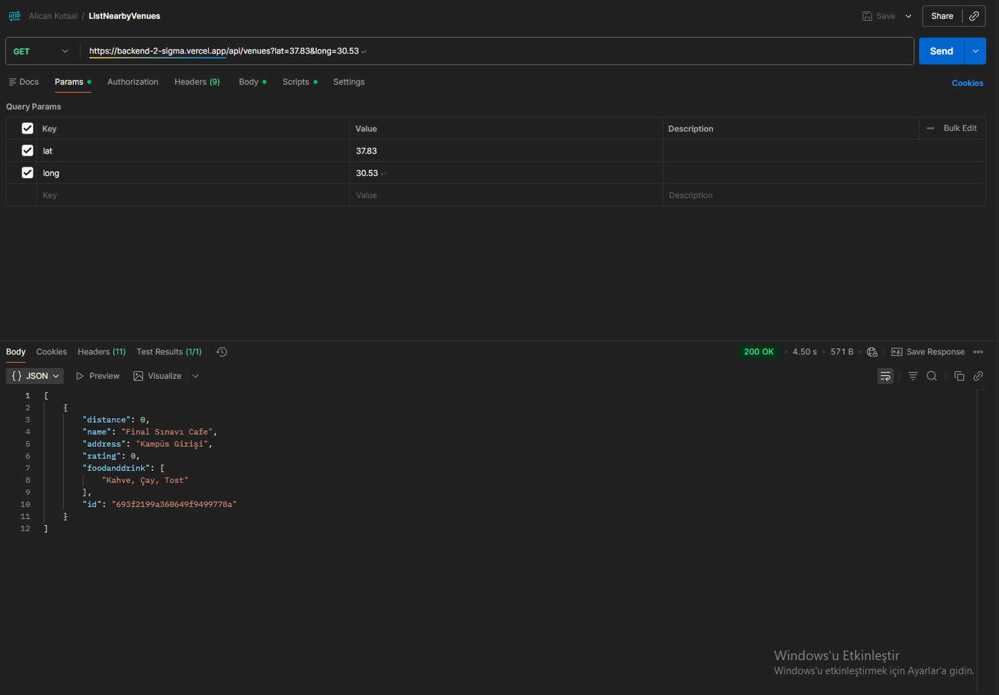
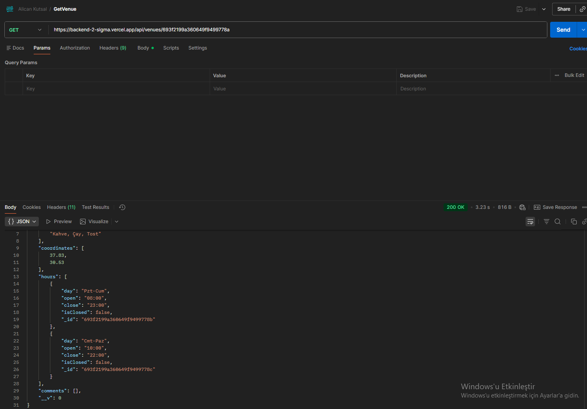
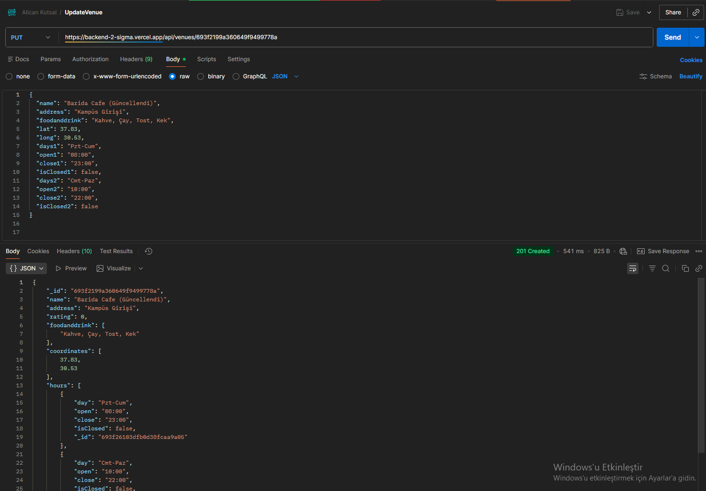
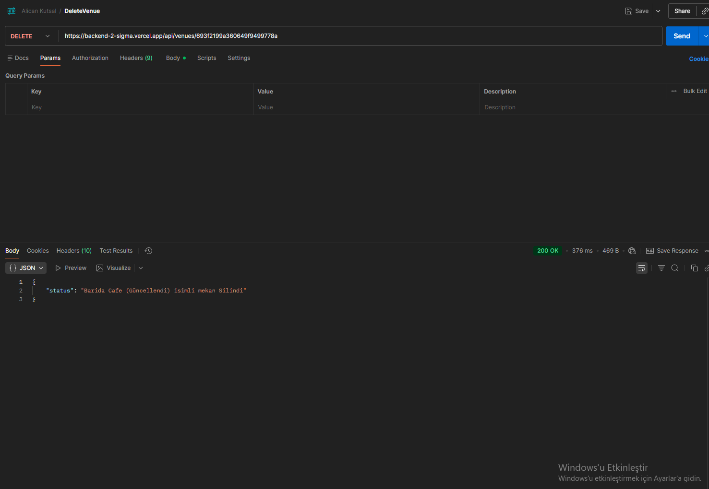
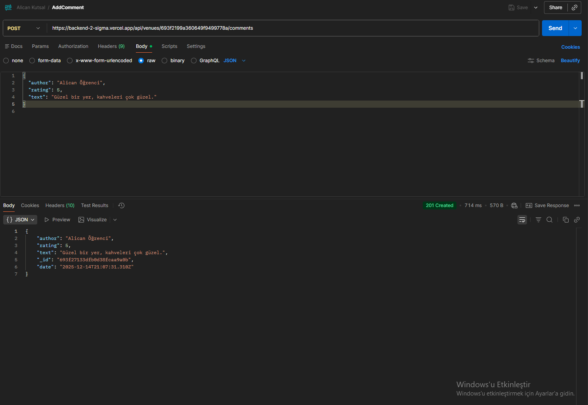
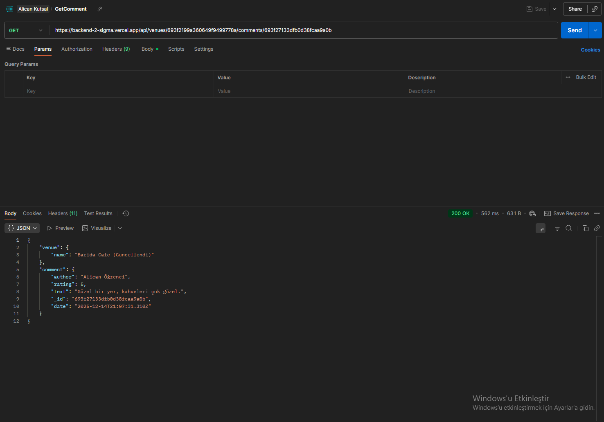
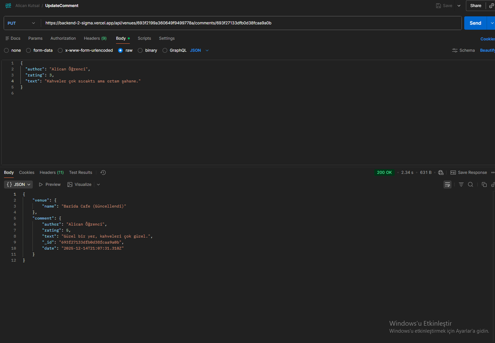
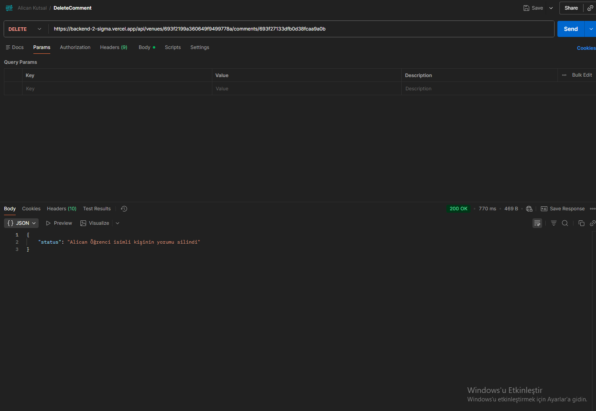

# Mekan Bul Backend Projesi (Final Ödevi)
**Öğrenci:** Alican Kutsal

Bu proje, Node.js, Express.js ve MongoDB Cloud kullanılarak geliştirilmiş bir REST API uygulamasıdır. Tüm proje Vercel üzerinde başarılı bir şekilde dağıtılmış (deploy) durumdadır.

---

## 🚀 Canlı Yayın Adresi (Vercel)

Uygulamanın aktif olarak çalıştığı ve tüm testlerin yapıldığı canlı API adresi:

**[https://backend-2-sigma.vercel.app](https://backend-2-sigma.vercel.app)**

## 📦 Proje Dosyaları ve Koleksiyon

* Projenin tüm API isteklerini içeren Postman koleksiyonu, ana dizinde yer almaktadır:
    * **Dosya Adı:** `Alican Kutsal.postman_collection.json`
* Tüm API testlerinin başarılı ekran görüntüleri `tests` klasöründe saklanmaktadır.

## ⚙️ API Uç Noktaları (Endpoints)

| Metot | Uç Nokta (Endpoint) | Açıklama |
| :--- | :--- | :--- |
| **GET** | `/api/venues?lat={lat}&long={long}` | Konuma göre mekanları listeler. |
| **POST** | `/api/venues` | Yeni bir mekan ekler. |
| **GET** | `/api/venues/:venueid` | Belirli bir mekanı getirir. |
| **PUT** | `/api/venues/:venueid` | Belirli bir mekanı günceller. |
| **DELETE**| `/api/venues/:venueid` | Belirli bir mekanı siler. |
| **POST** | `/api/venues/:venueid/comments` | Mekana yeni yorum ekler. |
| **GET** | `/api/venues/:venueid/comments/:commentid` | Belirli bir yorumu getirir. |
| **PUT** | `/api/venues/:venueid/comments/:commentid` | Belirli bir yorumu günceller. |
| **DELETE**| `/api/venues/:venueid/comments/:commentid`| Belirli bir yorumu siler. |

---

## ✅ API Test Ekran Görüntüleri (Kanıtlar)

Aşağıda, Vercel üzerindeki canlı adreste Postman kullanılarak yapılan tüm zorunlu API testlerinin başarılı sonuçları yer almaktadır.

### 1. Mekan İşlemleri

#### 1.1. Yeni Mekan Ekleme (POST /api/venues)
* Durum Kodu: `201 Created`

#### 1.2. Yakındaki Mekanları Listeleme (GET /api/venues?...)
* Durum Kodu: `200 OK`

#### 1.3. Belirli Bir Mekanı Getirme (GET /api/venues/:venueid)
* Durum Kodu: `200 OK`

#### 1.4. Mekan Bilgilerini Güncelleme (PUT /api/venues/:venueid)
* Durum Kodu: `200 OK`

#### 1.5. Mekan Silme (DELETE /api/venues/:venueid)
* Durum Kodu: `204 No Content`

### 2. Yorum İşlemleri

#### 2.1. Yorum Ekleme (POST /api/venues/:venueid/comments)
* Durum Kodu: `201 Created`

#### 2.2. Belirli Bir Yorumu Getirme (GET /api/venues/:venueid/comments/:commentid)
* Durum Kodu: `200 OK`

#### 2.3. Yorumu Güncelleme (PUT /api/venues/:venueid/comments/:commentid)
* Durum Kodu: `200 OK`

#### 2.4. Yorum Silme (DELETE /api/venues/:venueid/comments/:commentid)
* Durum Kodu: `204 No Content`
